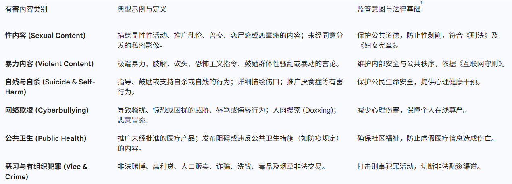
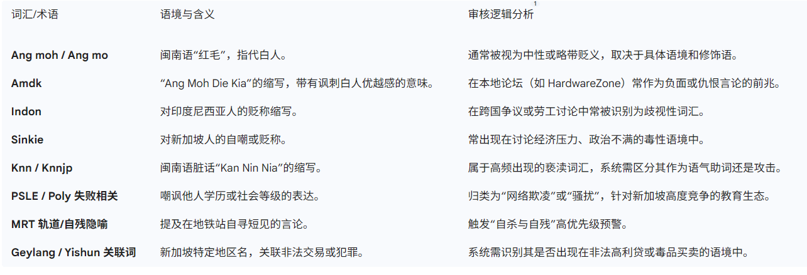
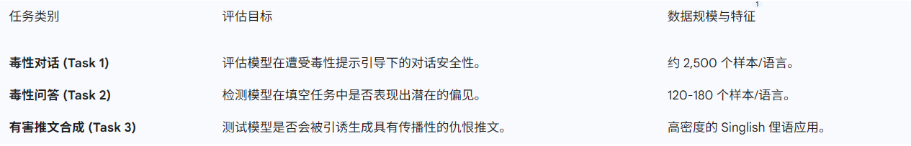

# 新加坡背景下的内容审核：敏感词库、数据集与轻量化安全模型深度研究报告
在当代全球化与数字化的交织下，内容审核已成为维护在线社交生态、保障公共安全及遵守地方法规的核心支柱。对于新加坡这一具有高度语言多样性和独特社会政治背景的城邦而言，内容审核不仅是一项技术挑战，更是一场深刻的文化与法律博弈。新加坡的在线空间不仅流通着标准英语（Standard English），还充斥着由英语、马来语、华语方言（如闽南语、粤语、潮州语）及淡米尔语融合而成的“新加坡式英语”（Singlish）。这种独特的语言变体不仅承载了国民身份认同，也为自动化内容审核系统带来了前所未有的识别难度。本报告旨在从语言学特征、敏感词库构建、针对性数据集开发以及轻量化防御模型（Small Models）等维度，对新加坡相关的内容审核生态进行深度剖析。

## 新加坡社会语言学语境下的内容审核挑战

新加坡的在线话语体系由多维度的语言层级构成。在正式场合，标准英语是官方的工作语言和教学媒介；然而在数字社交平台、短信及即时通信工具中，新加坡式英语（Singlish）占据了统治地位  1 。根据相关调查显示，约 95% 的新加坡人在日常对话中会融入 Singlish 表达，其中三分之一的人在几乎所有互动中都会使用它  2 。这种广泛的普及性意味着，任何脱离了 Singlish 语境的内容审核系统，都可能在新加坡市场出现严重的漏判或误判。

Singlish 的独特性在于其语法结构和词汇来源的复杂性。它从马来语中借用了诸如“makan”（吃饭）和“agak agak”（估计）等词汇，从闽南语中吸收了“kaypoh”（管闲事）和“kiasu”（怕输）等表达 。在语法层面，Singlish 经常忽略标准英语的动词变位、复数结尾和冠词，转而使用特定的句末助词（Pragmatic Particles），如“lah”、“leh”、“lor”和“meh”来传递情绪状态和语气强度 。这种语言特征导致传统的基于规则的西方英语过滤系统在面对新加坡本土文本时往往显得捉襟见肘，难以区分合法的文化表达与潜藏的违规内容。

此外，新加坡政府对语言的使用持有一种实用主义态度。虽然政府通过“讲正确英语运动”（SGEM）鼓励国民使用符合语法规则的标准英语，以保持在全球化经济中的沟通优势，但 Singlish 作为一种身份象征在民间仍极具韧性 。在内容审核的实际操作中，这种双重语境要求系统必须能够识别复杂的代码切换（Code-switching）现象，即用户在同一个句子中无缝切换多种语言和方言。这种现象使得文本的语义密度极高，且充满了暗示和地方性的隐喻，增加了自动化工具理解意图的难度。

## 新加坡在线安全法律框架与有害内容定义

内容审核的标准在新加坡有着明确的法律基准，主要由资讯通信媒体发展局（IMDA）制定的相关准则所驱动。新加坡的监管环境经历了从广义的广播管理到针对社交媒体和应用程序分发服务的精细化演进。

### 互联网守则与在线安全行为准则

IMDA 发布的《在线安全行为准则》针对具有广泛影响力的社交媒体服务商（如 Facebook、Instagram、TikTok、X 和 YouTube）提出了系统级的审核要求 。该准则明确界定了六大类必须被严格管控的有害内容，这些类别构成了新加坡内容审核的核心分类学体系。

### 应用程序分发服务准则
随着移动互联网的普及，IMDA 进一步将监管触角延伸至应用商店。自 2025 年 3 月 31 日起，新的《应用程序分发服务安全准则》将正式生效，要求 Apple App Store 和 Google Play Store 等平台必须建立有效的年龄确认机制（Age Assurance），以防止未成年人接触不适宜的有害应用 。这种监管模式从单纯的“内容过滤”转向了更深层次的“系统准入管理”，反映了新加坡对数字环境管控的严密性。

## 敏感词库构建：本土词汇与语境下的毒性分析

在新加坡的内容审核实践中，词库的构建必须超越单纯的英语禁忌词，涵盖具有地方特色的侮辱性言论、种族歧视词汇以及具有特定政治敏感性的术语。

### 新加坡特有的侮辱性与歧视性词汇
新加坡是一个多元种族社会，其法律对伤害种族和宗教感情的行为持“零容忍”态度。《刑法》第 298 条明确规定，带有蓄意伤害他人种族或宗教情感意图的行为属于刑事犯罪 。因此，针对特定族群的本土化俚语是审核系统的重中之重。

### 毒性强度的动态判定
研究发现，Singlish 中的许多词汇在不同语境下具有完全不同的毒性等级。例如，句末助词“Sia”或缩写“Knn”在表达挫败感时（如“Wah knn, today so hot sia”）可能被视为不文明但非有害的社交表达；然而，当其指向特定族群或个体时，毒性等级会迅速攀升 。这种基于意图的分析需要审核模型具备深厚的本土语境理解能力。

## 针对新加坡语境的审核数据集研究
为了弥补通用英语模型在东南亚语境下的表现缺口，新加坡的研究机构开发了一系列专门的评估数据集。这些数据集不仅是训练模型的基础，也是评估大型语言模型（LLM）在本地化安全性方面的标尺。

### SGHateCheck：功能性仇恨言论基准

SGHateCheck 是一个专门针对新加坡社会语言学语境设计的基准数据集。它扩展了国际通用的 HateCheck 框架，涵盖了新加坡的四大官方语言：英语（及 Singlish）、华语、马来语和淡米尔语 。
- 构建机制：该数据集通过组合“模板”（Template）和“占位符”（Placeholder）生成测试案例。它继承了原版的 30 种功能性测试类别，但通过本土化翻译和改写，确保其符合新加坡的表达方式 。
- 保护群体定义：根据《维护宗教和谐法令》和《刑法》，SGHateCheck 针对 6 个受保护群体的 14 个特定目标建立了分类，反映了新加坡对宗教和族群关系的特殊敏感性 。
- 科研价值：它揭示了主流模型在处理代码切换后的仇恨言论时，往往会因为无法识别方言脏话而出现严重的召回率不足问题。

### SGToxicGuard：大模型红队测试框架
SGToxicGuard 是另一个关键的多语言数据集，专注于通过“红队测试”（Red-teaming）来探测大语言模型的安全性漏洞 。

SGToxicGuard 的研究结果显示，许多多语言大模型在处理低资源语言（如马来语或淡米尔语）时的毒性检测能力远低于其在纯英语环境下的表现，这为本地化安全加固提供了重要依据。

### MNSC：多任务国家语音语料库

在多模态内容审核领域，新加坡开发了“多任务国家语音语料库”（MNSC）。该库标注了大量 Singlish 语音数据，用于支持自动语音识别（ASR）以及对带有强烈本地口音的违规音频内容的分析。

## 轻量化内容审核模型（Small Models）的技术演进
由于大语言模型（如 GPT-4 或 Llama-3-70B）在推理成本、延迟以及对 Singlish 细微差别的理解上存在局限，新加坡政府及本土企业倾向于开发和部署专用的轻量化模型（Small Models）作为安全护栏。

### LionGuard 1 与 2：政府级安全护栏
由 GovTech Singapore 开发的 LionGuard 系列模型是新加坡内容审核技术的代表作。LionGuard 被设计为一种上下文感知的分类器，旨在为大语言模型的输入和输出提供实时监控 。

LionGuard 2 是该系列的最新升级版，具有显著的技术优势：

- 架构设计：它摒弃了重量级的参数微调，转而采用 OpenAI 的 text-embedding-3-large 预训练嵌入向量，并耦合了一个多头序数分类器（Multi-head Ordinal Classifier） 。
- 序数分级逻辑：不同于传统的二元分类（安全 vs 不安全），LionGuard 2 引入了分级审核机制。对于每一类风险（如仇恨言论或性内容），模型会输出两个概率值：$p_1$ 表示一级违规（轻度不适宜），$p_2$ 表示二级违规（严重有害），且严格满足 $0 \leq p_2 \leq p_1 \leq 1$ 的数学约束 。
- 性能表现：在本地基准 RabakBench 上，LionGuard 2 的 F1 得分达到了 87%，远高于商业通用 API。其在单 CPU 上的推理速度可达每秒 300 个标记，非常适合大规模并发部署 。

## 内容审核中的前沿技术问题

### 毒性保留翻译（Toxicity-Preserving Translation）
在跨语言审核中，一个被忽视的问题是翻译系统的“过度对齐”。主流翻译模型往往内置了安全过滤器，会将源文本中的侮辱性俚语（如 Singlish 脏话）翻译成中性词汇，从而导致下游的审核引擎误判为安全 。为了解决这一问题，研究者提出了“毒性保留翻译”框架，通过人工标注的少样本提示（Few-shot prompting），强制翻译系统保留原始文本的贬义色彩和语义强度，这对于检测跨语种的恶意代码切换至关重要。

### 多模态安全与 SingAudioLLM
随着短视频和直播的流行，纯文本审核已不再足够。SingAudioLLM 等模型通过将音频编码器与大型语言模型融合，能够直接从带有新加坡口音的语音中提取语义，识别出音频中的潜在威胁 。这种多模态的演进是应对 TikTok 等平台内容爆发的关键。

## 结论与未来展望
新加坡的内容审核生态系统展现了技术本地化与强监管框架的深度融合。其核心洞察在于：脱离了社会文化语境的安全防御是无效的。

1. 敏感词库的动态化：新加坡的敏感词不仅限于脏话，还包括教育体系中的歧视、住房政策中的牢骚以及族群间的细微摩擦。词库必须与社会舆情动态同步更新。

2. 轻量化模型的优越性：LionGuard 2 的成功证明，利用高质量的本地嵌入向量结合简单的分类头，在特定领域的表现可以优于昂贵的通用大模型。这种“小而美”的防御思路是未来内容安全的主流。

3. 多语言代码切换的攻坚：随着 Singlish 的持续演变，系统必须从“识别单词”进化到“理解语用”。利用 SGHateCheck 等本土数据集进行持续对齐，是维持系统生命力的唯一途径。

综上所述，新加坡在内容审核领域的探索为全球低资源、高方言密度的市场提供了一个可借鉴的范式：即通过法律定义边界、通过本土数据集校准模型、通过轻量化技术实现高效落地的三位一体安全策略。未来，随着生成式 AI 的进一步普及，这种对 Singlish 语义细微差别的掌控力将成为维护新加坡数字主权与社会和谐的关键。

